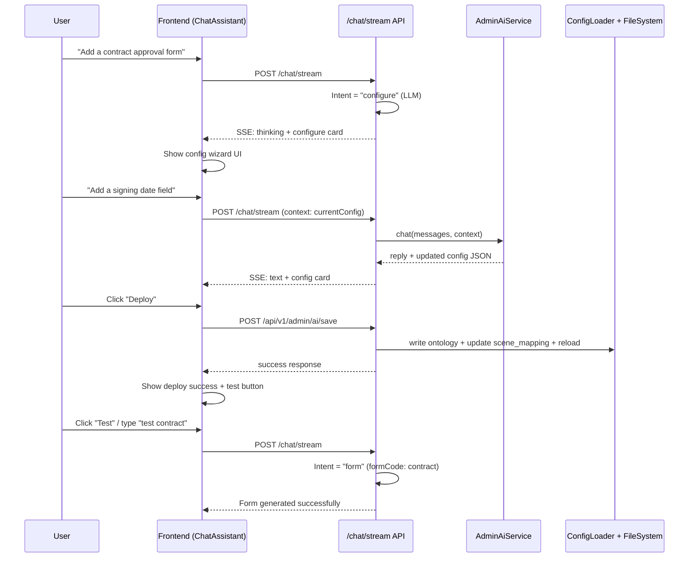

## User Requirements

- **Not the admin panel AI chat assistant** - previously implemented approach was wrong
- **True requirement**: In the **main chat window** (ChatAssistant.vue), leverage AI to **automate the entire "New Business Form Configuration" process** as described in the extension manual
- The manual describes 5 manual steps to add a new form type. The user wants this done via **natural language conversation in the main chat interface**
- End-to-end flow: User describes a business scenario -> AI generates ontology + scene mapping + keywords -> One-click deploy -> Instantly testable in the same chat

## Product Overview

A "New Business Configuration Wizard" embedded directly in the main chat flow. When users say things like "I want to add a contract approval form", the system recognizes this as a `configure` intent (new intentType), generates all necessary configuration files via LLM, presents a visual preview in the chat, and deploys with one click - making the new form immediately available for use.

## Core Features

1. **Intent Recognition**: Detect "configure/create new form type" as `configure` intent (distinct from `form`/`form_update`/`chat`)
2. **Multi-turn Configuration Dialog**: AI chat to iteratively design ontology (fields, types, entities, required flags)
3. **Auto Scene Keywords**: AI generates scene mapping keywords automatically
4. **Visual Preview**: Show field structure preview card in the chat message
5. **One-click Deploy**: Save ontology JSON + update scene_mapping.json + hot-reload, all from chat
6. **Instant Test**: After deploy, user can immediately test the new form type in the same conversation

## Tech Stack

- Backend: Python 3 + FastAPI (existing)
- Frontend: Vue 3 + Element Plus (existing)
- LLM: Existing `llm_service` singleton (`_call_llm`, `_call_llm_sync`)
- Config: Existing `ConfigLoader` with `reload_config()` hot-reload
- File I/O: Existing `AdminService` for ontology CRUD + scene mapping updates

## Tech Architecture

### System Flow



### Implementation Approach

- **New intentType `configure`**: Add to `smart_intent_recognition.txt` prompt. LLM distinguishes "I want to fill a form" (form) vs "I want to add/create a new form type" (configure)
- **Backend `configure` handler**: In `chat.py`'s stream handler, add a new branch for `intentType == "configure"` that delegates to `AdminAiService.chat()` and returns structured SSE events including a `config` event type
- **New SSE event type `config`**: Carries the generated ontology JSON + validation status to frontend
- **Frontend config card**: A new message component rendered inline in the chat (not a separate page), showing field preview + "Deploy" + "Modify" buttons
- **Deploy flow**: Reuses existing `AdminService.create_ontology()` + `AdminService.update_scene_mappings()` + `config_loader.reload_config()` - already proven in admin_ai.py
- **No new files for backend service layer**: AdminAiService already handles LLM chat for config generation, AdminService handles file I/O and hot-reload

### Key Design Decisions

1. **Separate `configure` intent from `form`**: Clean separation. `form` = fill existing form, `configure` = create new form type. No ambiguity.
2. **Keep conversation context**: The `currentConfig` (draft ontology) is maintained in frontend state, sent with each configure request as context for iterative editing
3. **Inline config card (not sidebar)**: The preview is rendered as part of the chat flow, keeping the user in context
4. **Reuse AdminAiService**: Already has SYSTEM_PROMPT, `_extract_json_from_reply()`, `_validate_ontology()`, `generate_scene_keywords()` - battle-tested
5. **Prompt template approach**: Modify `smart_intent_recognition.txt` to include `configure` intent recognition, avoiding a separate prompt file

### Directory Structure

```
backend/
  app/
    api/
      chat.py                           # [MODIFY] Add configure intent handler in chat_stream
    services/
      admin_ai_service.py               # [MODIFY] Minor: ensure _call_llm matches current API
    config_loader.py                    # [NO CHANGE] Already supports hot-reload
  config/
    prompts/
      smart_intent_recognition.txt      # [MODIFY] Add configure intent rules + examples

frontend/
  src/
    components/
      ChatAssistant.vue                 # [MODIFY] Add configure card rendering + deploy flow
      ConfigCard.vue                    # [NEW] Inline config preview card component
```

### Implementation Notes

- **Blast radius control**: The `configure` branch is a new `elif` in `chat_stream()`, no changes to existing `form`/`form_update`/`chat` branches
- **Fallback safety**: If configure intent is mis-identified, user can still use the form normally
- **Performance**: `AdminAiService.chat()` uses sync LLM call (~1-3s), acceptable for config tasks; no streaming needed for config responses
- **Backward compatibility**: Existing SSE event types unchanged; `config` is a new additive event type
- **Security**: Config write operations use existing AdminService which validates formCode format
- **Logging**: Reuse existing `admin_ai_service` logger; add `configure_intent` to `_LOG_MODULES` in main.py

## Design Approach

The config wizard is embedded directly into the existing chat flow as inline message cards, maintaining the conversational metaphor. The design follows the existing ChatAssistant visual language (purple gradient theme, card-based layout).

### Page: Chat Window with Config Wizard

**Block 1: Config Introduction Card**
When configure intent is detected, AI shows a text explanation of what it understood, followed by a structured config preview card. The card has a header (form name + code), field list organized by entity, and action buttons (Deploy/Modify/Cancel).

**Block 2: Field Preview in Config Card**
Each entity is a collapsible group showing entity name, with fields listed as rows. Each field shows: fieldCode, fieldName (Chinese), type badge (color-coded), required indicator. Matches the existing ontology structure.

**Block 3: Deploy Confirmation Flow**
Deploy button triggers ElMessageBox.confirm. On success, a success toast appears and the card transforms to show "Deployed" status with a "Test Now" button that pre-fills the chat input.

**Block 4: Iterative Edit Flow**
When user provides modifications, the config card updates in-place. The previous version is shown as a diff indicator (optional, v1 can just replace).

All visual elements use the existing design tokens from ChatAssistant.vue.

## Agent Extensions

### SubAgent

- **code-explorer**
- Purpose: Explore existing codebase patterns and verify file paths/API signatures before implementation
- Expected outcome: Confirmed architecture details, accurate modification targets