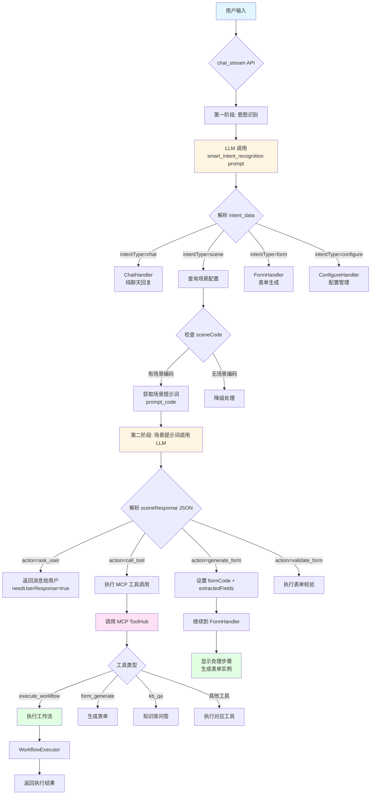

# 聊天 - 场景 - 提示词 - 工具调用 架构解析

## 📊 整体架构流程图



---

## 🔍 详细流程说明

### **阶段 1: 用户输入 → 意图识别**

#### 1.1 接收请求
```python
# backend/app/api/chat.py: chat_stream()
POST /api/v1/chat/stream
{
  "messages": [
    {"role": "user", "content": "帮我填一个请假申请"}
  ]
}
```

#### 1.2 构建意图识别 Prompt
```python
# backend/app/api/chat_service.py: build_intent_prompt()
prompt = smart_intent_recognition_template.format(
    ontologies_info=本体信息,
    scene_hierarchy=场景层级,
    scene_keywords=场景关键词,
    mcp_tools_info=MCP 工具列表,  # ← 包含 execute_workflow 等工具
    messages_text=对话历史,
    last_user_message=用户最新消息
)
```

**Prompt 示例**:
```
你是一个智能助手，请分析用户意图。

## 可用场景
- leave_application: 请假申请
- expense_report: 报销申请

## 可用 MCP 工具
- execute_workflow(workflow_code, inputs): 执行工作流
- form_generate(user_input): 生成表单
- kb_qa(question): 知识库问答

## 用户输入
帮我填一个请假申请

请返回 JSON:
{
  "intentType": "scene",
  "sceneCode": "leave_application",
  "confidence": 0.9
}
```

#### 1.3 LLM 返回意图
```json
{
  "intentType": "scene",
  "sceneCode": "leave_application",
  "confidence": 0.95,
  "reasoning": "用户想要填写请假申请"
}
```

---

### **阶段 2: 场景识别 → 场景提示词**

#### 2.1 查询场景配置
```python
# backend/app/api/chat.py: line ~340
if scene_code:
    # 从数据库查询场景配置
    scene = db.query(Scene).filter(Scene.scene_code == scene_code).first()
    
    # 获取场景关联的提示词编码
    prompt_code = scene.prompt_code  # 例如: "leave_application_prompt"
```

**场景配置示例**:
```json
{
  "sceneCode": "leave_application",
  "sceneName": "请假申请",
  "promptCode": "leave_application_prompt",  // ← 关键！
  "formCode": "leave_form",
  "description": "员工请假申请场景"
}
```

#### 2.2 获取场景提示词
```python
# backend/app/api/chat_service.py: get_scene_prompt_by_code()
prompt_content = db.query(PromptTemplate).filter(
    PromptTemplate.prompt_code == prompt_code
).first().content
```

**场景提示词示例** (`leave_application_prompt`):
```
你是一个请假申请助手。请从用户输入中提取以下信息：

1. 请假类型（事假/病假/年假）
2. 开始日期
3. 结束日期
4. 请假原因

如果信息不完整，请询问用户补充。

输出格式：
{
  "action": "generate_form",
  "formCode": "leave_form",
  "extractedFields": {
    "leave_type": "事假",
    "start_date": "2026-05-20",
    "end_date": "2026-05-22",
    "reason": "家里有事"
  },
  "missingInfo": [],
  "needUserResponse": false
}
```

#### 2.3 使用场景提示词调用 LLM
```python
# backend/app/api/chat.py: line ~384
scene_response = llm_service._call_llm_sync(
    user_input=last_user_message,
    system_prompt=scene_prompt_content  # ← 使用场景特定的提示词
)
```

---

### **阶段 3: 场景响应 → 动作执行**

#### 3.1 解析场景响应
```python
# backend/app/api/chat.py: line ~470
scene_json = json.loads(scene_response)
action = scene_json.get("action")
```

#### 3.2 根据 action 执行不同逻辑

##### **Action 1: ask_user** (询问用户)
```json
{
  "action": "ask_user",
  "message": "请问您要请什么类型的假？",
  "needUserResponse": true
}
```
**处理**: 直接返回消息给用户，等待用户回答

---

##### **Action 2: call_tool** (调用工具)
```json
{
  "action": "call_tool",
  "toolCalls": [
    {
      "name": "execute_workflow",
      "arguments": {
        "workflow_code": "leave_approval",
        "inputs": {
          "employee_id": "EMP001",
          "leave_days": 3
        }
      }
    }
  ]
}
```

**处理流程**:
```python
# backend/app/api/chat_service.py: execute_tool_calls()
for tool_call in tool_calls:
    tool_name = tool_call["name"]
    tool_args = tool_call["arguments"]
    
    # 调用 MCP ToolHub
    hub = get_toolhub()
    if hub.has_tool(tool_name):
        result = hub.execute_sync(tool_name, tool_args)
        
        # 如果是 execute_workflow
        if tool_name == "execute_workflow":
            # 返回工作流执行结果
            workflow_result = result["result"]
```

---

##### **Action 3: generate_form** (生成表单)
```json
{
  "action": "generate_form",
  "formCode": "leave_form",
  "extractedFields": {
    "leave_type": "事假",
    "start_date": "2026-05-20",
    "end_date": "2026-05-22"
  },
  "needUserResponse": false
}
```

**处理流程**:
```python
# backend/app/api/chat.py: line ~698
if action == "generate_form":
    # 设置 formCode 和 extractedFields
    intent_data["formCode"] = scene_json["formCode"]
    intent_data["extractedFields"] = scene_json["extractedFields"]
    
    # 设置 intent_type 为 form，交给 FormHandler 处理
    intent_type = "form"
    
    # 继续执行，进入 FormHandler
    # FormHandler 会显示处理步骤并生成表单实例
```

---

##### **Action 4: validate_form** (校验表单)
```json
{
  "action": "validate_form",
  "formCode": "leave_form",
  "validationRules": [
    {
      "field": "leave_days",
      "rule": "max_30_days",
      "message": "请假天数不能超过30天"
    }
  ]
}
```

**处理**: 执行表单校验，返回校验结果

---

### **阶段 4: Handler 分发 → 最终响应**

#### 4.1 意图处理器注册表
```python
# backend/app/intent/registry.py
_handlers = {
    "form": FormHandler(),           # 表单生成
    "chat": ChatHandler(),           # 纯聊天
    "configure": ConfigureHandler(), # 配置管理
    "validate": ValidationHandler(), # 表单校验
    # ... 其他 handler
}
```

#### 4.2 分发到对应 Handler
```python
# backend/app/api/chat.py: line ~750
handler = registry.get_handler(intent_type)
async for event in handler.handle(ctx):
    yield event  # SSE 流式输出
```

---

## 🎯 关键设计要点

### 1. **两阶段意图识别**

```
第一阶段: 通用意图识别
  ↓
  判断是 chat / scene / form / configure
  
第二阶段: 场景特定处理（仅当 intentType=scene）
  ↓
  使用场景提示词再次调用 LLM
  ↓
  得到具体的 action 和参数
```

**为什么需要两阶段？**
- ✅ 第一阶段快速路由，避免不必要的场景提示词调用
- ✅ 第二阶段精准处理，利用场景特定的业务逻辑
- ✅ 解耦通用逻辑和场景逻辑

---

### 2. **场景与提示词的关系**

```
Scene (场景)
  ├─ scene_code: 场景编码
  ├─ prompt_code: 关联的提示词编码  ← 关键映射
  ├─ form_code: 默认表单编码
  └─ description: 场景描述

PromptTemplate (提示词模板)
  ├─ prompt_code: 提示词编码
  ├─ content: 提示词内容
  ├─ category: 分类
  └─ is_active: 是否启用
```

**关系**: 一个场景可以关联一个提示词模板，通过 `prompt_code` 连接

---

### 3. **MCP 工具的调用时机**

MCP 工具可以在两个地方被调用：

#### **位置 1: 意图识别阶段**
```python
# 在 smart_intent_recognition prompt 中包含 MCP 工具列表
# LLM 可以直接决定调用工具

{
  "intentType": "scene",
  "sceneCode": "order_query",
  "toolCalls": [
    {
      "name": "execute_workflow",
      "arguments": {...}
    }
  ]
}
```

#### **位置 2: 场景响应阶段**
```python
# 场景提示词的 response 中指定要调用的工具
{
  "action": "call_tool",
  "toolCalls": [...]
}
```

**区别**:
- 位置 1: 通用场景，LLM 自主决策
- 位置 2: 特定场景，由场景提示词控制

---

### 4. **工作流工具的集成点**

```
execute_workflow MCP 工具
  ↓
MCPToolHub.execute_sync("execute_workflow", args)
  ↓
workflow_tools.py: execute_workflow()
  ↓
WorkflowService.get_workflow(workflow_code)
  ↓
WorkflowExecutor.execute(inputs)
  ↓
返回执行结果
```

**关键点**: 工作流是通过 MCP 工具的方式暴露给 LLM 的，而不是直接调用

---

## 📝 完整示例：用户说"帮我处理订单"

### Step 1: 意图识别
```
用户输入: "帮我处理订单"
  ↓
LLM (smart_intent_recognition):
{
  "intentType": "scene",
  "sceneCode": "order_processing",
  "confidence": 0.9
}
```

### Step 2: 查询场景
```
scene_code = "order_processing"
  ↓
查询数据库:
{
  "sceneCode": "order_processing",
  "promptCode": "order_processing_prompt",
  "formCode": "order_form"
}
```

### Step 3: 获取场景提示词
```
prompt_code = "order_processing_prompt"
  ↓
查询提示词模板:
"""
你是订单处理助手。请从用户输入中提取订单号。

如果可以提取订单号，调用 execute_workflow 工具处理订单。

输出格式：
{
  "action": "call_tool",
  "toolCalls": [...]
}
"""
```

### Step 4: 场景提示词调用 LLM
```
LLM (使用场景提示词):
{
  "action": "call_tool",
  "toolCalls": [
    {
      "name": "execute_workflow",
      "arguments": {
        "workflow_code": "order_processing_workflow",
        "inputs": {
          "order_id": "ORD-12345"
        }
      }
    }
  ]
}
```

### Step 5: 执行 MCP 工具
```
execute_tool_calls()
  ↓
hub.execute_sync("execute_workflow", {...})
  ↓
workflow_tools.py: execute_workflow()
  ↓
WorkflowExecutor.execute({...})
  ↓
返回: {
  "success": true,
  "result": {
    "execution_id": "exec_xxx",
    "status": "completed",
    "outputs": {...}
  }
}
```

### Step 6: 返回给用户
```
SSE 流式输出:
- thinking: "正在处理订单..."
- reasoning: "调用订单处理工作流"
- text: "订单 ORD-12345 已处理完成！"
- stats: {...}
```

---

## 🔧 架构优势

### 1. **分层清晰**
- 第一层: 意图识别（通用）
- 第二层: 场景处理（特定）
- 第三层: 工具执行（能力）

### 2. **灵活扩展**
- 新增场景: 添加 Scene + PromptTemplate
- 新增工具: 添加 MCP 工具
- 新增工作流: 自动通过 execute_workflow 可用

### 3. **职责分离**
- chat.py: 流程编排
- chat_service.py: 服务封装
- intent/handlers: 具体处理
- mcp_tools: 能力提供

### 4. **可观测性**
- 每个阶段都有日志
- SSE 实时推送进度
- 完整的统计信息

---

## ⚠️ 常见误区

### ❌ 误区 1: 认为 LLM 直接调用工作流
**正确**: LLM → MCP 工具 → WorkflowExecutor

### ❌ 误区 2: 认为场景提示词是可选的
**正确**: 场景提示词是场景驱动的核心，定义了场景的业务逻辑

### ❌ 误区 3: 认为 intentType 只能是 chat/form
**正确**: intentType 包括 chat/scene/form/configure 等，scene 是最关键的

### ❌ 误区 4: 认为工具调用只在意图识别阶段
**正确**: 工具调用可以在意图识别阶段或场景响应阶段

---

## 📚 相关文件索引

| 文件 | 作用 |
|------|------|
| `backend/app/api/chat.py` | 主流程编排 |
| `backend/app/api/chat_service.py` | 服务层封装 |
| `backend/app/intent/registry.py` | 意图处理器注册 |
| `backend/app/intent/handlers/*` | 具体处理器实现 |
| `backend/app/mcp_tools/workflow_tools.py` | 工作流 MCP 工具 |
| `backend/app/engine/workflow_executor.py` | 工作流执行引擎 |
| `config/prompts/smart_intent_recognition.txt` | 意图识别 prompt |
| `config/prompts/*.txt` | 场景提示词模板 |

---

**更新日期**: 2026-05-18  
**版本**: v1.0
